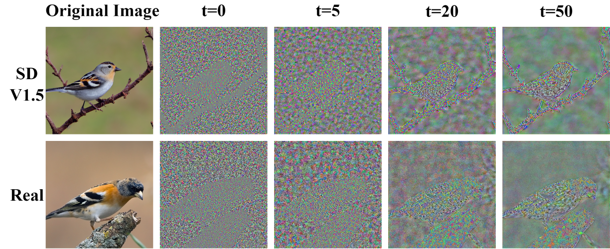
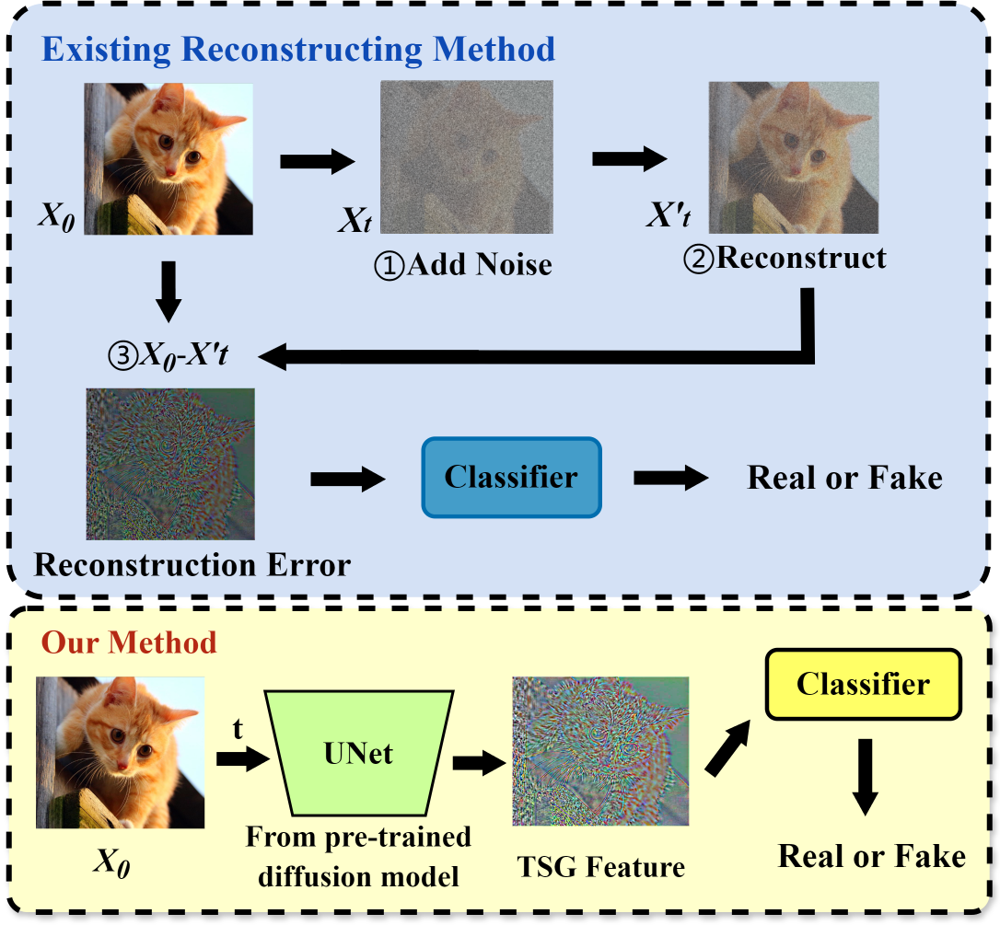

# Time Step Generating: A Universal Synthesized Deepfake Image Detector
<b><a>Ziyue Zeng</a></b>, <b><a>Haoyuan Liu</a></b>, <b><a>Dingjie Peng</a></b>, <b><a>Luoxu Jin</a></b>,  <b><a>Hiroshi Watanabe</a></b>

[[Paper](https://arxiv.org/abs/2411.11016)] https://arxiv.org/abs/2411.11016


## Get Started
- [Overview](#overview)
- [Install](#install)
- [Dataset](#download-genimage-dataset)
- [Train / Val / Test](#train--val--test)
- [Download Pre-trained Models](#pre-trained-models)
- [Acknowlegdements](#acknowlegdements)
- [Citation](#citation)

## Overview
### Abstract
  > Currently, high-fidelity text-to-image models are developed in an accelerating pace. Among them, Diffusion Models have led to a remarkable improvement in the quality of image generation, making it vary challenging to distinguish between real and synthesized images. It simultaneously raises serious concerns regarding privacy and security. Some methods are proposed to distinguish the  diffusion model generated images through reconstructing. However, the inversion and denoising processes are time-consuming and heavily reliant on the pre-trained generative model. Consequently, if the pre-trained generative model meet the problem of out-of-domain, the detection performance declines. To address this issue, we propose a universal synthetic image detector  **T**ime **S**tep **G**enerating (**TSG**), which does not rely on pre-trained models' reconstructing ability, specific datasets, or sampling algorithms. Our method utilizes a pre-trained diffusion model's network as a feature extractor to capture fine-grained details, focusing on the subtle differences between real and synthetic images. By controlling the time step t of the network input, we can effectively extract these distinguishing detail features. Then, those features can be passed through a classifier (*i.e.* Resnet), which efficiently detects whether an image is synthetic or real. We test the proposed **TSG** on the large-scale GenImage benchmark and it achieves significant improvements in both accuracy and generalizability.

<p align="center">

</p>
<p align="center">
  <em>TSG features at different time step <span style="font-style: normal;">t</span>.</em>
</p>


### TSG pipeline
<p align="center">

</p>
<p align="center">
  <em>Overview of the previous reconstructing based method and TSG method.</em>
</p>

## Install

### Clone Repo.
```
git clone https://github.com/NuayHL/TimeStepGenerating.git
```
### Create Environment
```
conda create -n tsg python=3.9
conda activate tsg
pip install torch==2.0.0+cu117 torchvision==0.15.1+cu117 -f https://download.pytorch.org/whl/torch_stable.html
pip install -r requirements.txt
```

### Download GenImage Dataset

[[GenImage](https://github.com/GenImage-Dataset/GenImage)] https://github.com/GenImage-Dataset/GenImage

This repository is the official repository of the `GenImage` benchmark and contains the GenImage dataset and the evaluated methods.

### Creating Default Data Folder
For certain dataset `DATASET_X` in `GenImage`, its correspond TSG feature image should be placed using following fold structrue. 

*It is **recommanded** to create these void file folder ahead of generating TSG features*

`0_real` is for the TSG features generated by *nature* / *real* images, `1_fake` is for the TSG features generated by *ai* / *fake* images.
```
└── TimeStepGenerating/data
    ├── test
    |   ├── DATASET_X
    |   |   ├── 0_real
    |   |   └── 1_fake
    ├── test
    |   ├── DATASET_X
    |   |   ├── 0_real
    |   |   └── 1_fake
    ├── test
    |   ├── DATASET_X
    |   |   ├── 0_real
    |   |   └── 1_fake
    ...  ...
```
Replace `DATASET_X` with the name represeting certain datasets in `GenImage` to performe experiments

## Train / Val / Test

### Geting TSG Features
First, you need to creat `train`/`val` TSG features for `DATASET_X`. Since the `GenImage` benchmark does not include `test` split, please copy the `val` TSG features to the `test` folder under the same dataset name after you obtained `val` TSG features.  

- Download pre-trained diffusion ckpt `256x256_diffusion_uncond.pt` where you can find in our [Pre-trained Models](#pre-trained-models) storage or in official site [guided-diffusion](https://github.com/openai/guided-diffusion)

- Computer feature using `guided-diffusion/compute_feature.py`
  - `--images_dir`: the original images dir for `DATASET_X`, usually splitted by ai/natrue and train/val.
  - `--recons_dir`: the TSG features dir for `DATASET_X`, which is created in advance in [Creating Default Data Folder](#creating-default-data-folder).
  - `--model_path`: the pretrained diffision model ckpt.
  - `--time_step`: the time step param for generating the TSG features, ranging from 0-50

1. `train`-fake
```
python -u guided-diffusion/compute_feature.py --images_dir=DATASET_X/train/ai \
                                              --recons_dir=data/train/DATASET_X/1_fake \
                                              --model_path=256x256_diffusion_uncond.pt \
                                              --time_step=0
```
2. `train`-real
```
python -u guided-diffusion/compute_feature.py --images_dir=DATASET_X/train/nature \
                                              --recons_dir=data/val/DATASET_X/0_real \
                                              --model_path=256x256_diffusion_uncond.pt \
                                              --time_step=0
```
3. `val`-fake
```
python -u guided-diffusion/compute_feature.py --images_dir=DATASET_X/val/ai \
                                              --recons_dir=data/val/DATASET_X/1_fake \
                                              --model_path=256x256_diffusion_uncond.pt \
                                              --time_step=0
```
4. `val`-real
```
python -u guided-diffusion/compute_feature.py --images_dir=DATASET_X/val/nature \
                                              --recons_dir=data/val/DATASET_X/0_real \
                                              --model_path=256x256_diffusion_uncond.pt \
                                              --time_step=0
```
5. `test`
```
cp -r data/val/DATASET_X/* data/test/DATASET_X/
```

### Training Classifier

- Training the default `Resnet50` classifier using `train.py`
  - `--exp_name`: custom experiments name create by yourself, including info. for train/val result and classifier ckpt.
  - `--datasets`: training TSG feature dataset. 
  - `--datasets_test`: val TSG feature dataset during training, under `data/val`.
```
python train.py --gpus 0 --exp_name YOUR_EXP_NAME datasets DATASET_X datasets_test DATASET_X
```

### Evalulating Classifier
- Evaluate the trained classifier using `test.py`
  - `--exp_name`: custom experiments name create by yourself in training, including info. for train/val result and classifier ckpt.
  - `--datasets_test`: test TSG feature dataset, under `data/test`.
```
python test.py --gpus 0 --exp_name YOUR_EXP_NAME --ckpt model_epoch_best.pth datasets_test DATASET_X
```


## Pre-trained Models

https://drive.google.com/drive/folders/15pFlz_YQibWznzsmy1279mfev4wZ2FAs?usp=drive_link

Includes the pre-trained classifers' ckpt in our paper.

These models are trained in 1 epoch to prevent overfitting.

However, training for more epoches is expected to have better cross-datasets performance.

## Acknowlegdements

This code is developed on [DIRE](https://github.com/ZhendongWang6/DIRE). Thanks for their sharing codes and models

## Citation
If you find this work useful for you research, please cite our paper:
```
@article{zeng2024tsg,
         title={Time Step Generating: A Universal Synthesized Deepfake Image Detector},
         author={Zeng, Ziyue and Liu, Haoyuan and Peng, Dingjie and Jin, Luoxu and Watanabe, Hiroshi},
         journal={arXiv preprint arXiv:2411.11016},
         year={2024}}
```